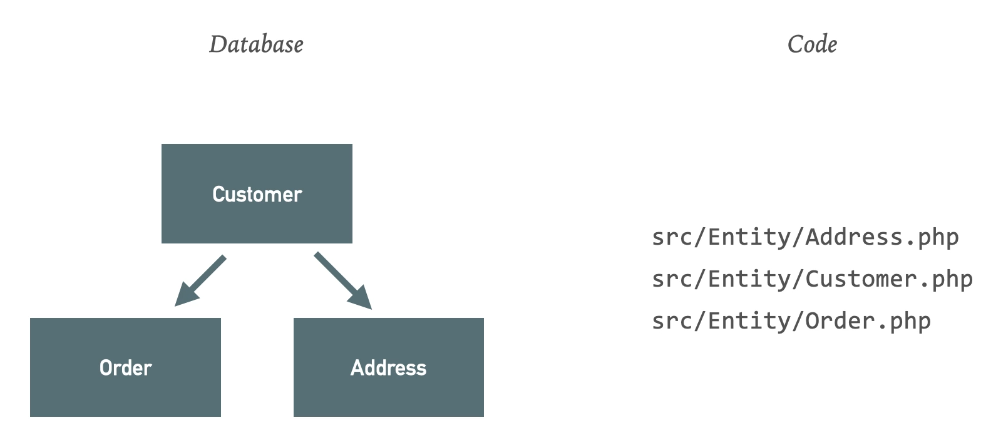
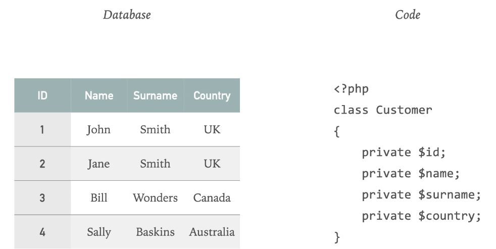
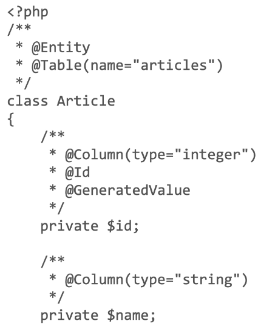
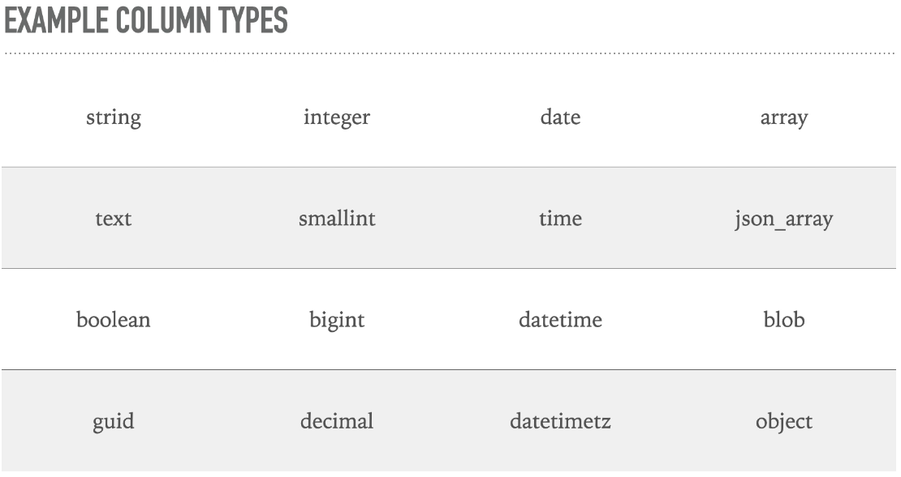
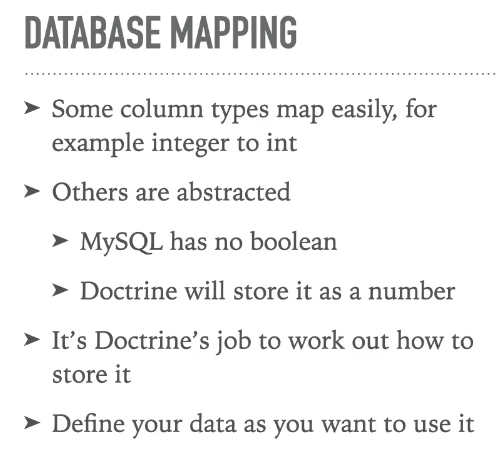

# Doctrine ORM

By [Udemy course](https://www.udemy.com/course/doctrine-orm-php/) by Crhis Worfolk

## What are entities?

## Columns

## Connection between DB and definitions (mapping)

## Column types

